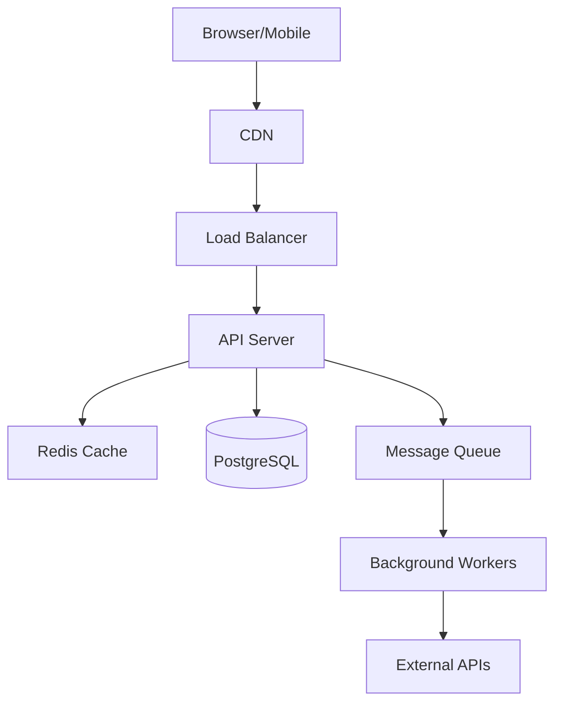

# Claude Code CLI Mastery: Autonomous Product Development

> **From Idea to Shipped Product Using AI as Your Full-Stack Team**

---

## Table of Contents

1. [Core Philosophy: The Product Factory Mindset](#module-1-core-philosophy)
2. [Claude Code CLI Fundamentals](#module-2-cli-fundamentals)
3. [Configuration & Control](#module-3-configuration-control)
4. [Agent & Skill Architecture](#module-4-agent-skill-architecture)
5. [Autonomous Development Mode](#module-5-autonomous-development-mode)
6. [MCP, Tools & Extensions](#module-6-mcp-tools-extensions)
7. [Product Delivery Pipeline](#module-7-product-delivery-pipeline)
8. [Marketing & GTM Automation](#module-8-marketing-gtm)
9. [Reference Templates & Examples](#module-9-reference-templates)

---

# Module 1: Core Philosophy

## The Mental Model Shift

Claude Code is **not** a code completion tool. It's an **autonomous development partner** capable of operating as a founder + CTO + product team.

### Traditional AI Coding vs. Autonomous Product Building

| Traditional Approach | Autonomous Approach |
|---------------------|---------------------|
| "Write a function that..." | "Build a SaaS that..." |
| Line-by-line prompting | Strategic delegation |
| Human reviews every change | Human makes key decisions only |
| Code generation | End-to-end product creation |
| Task executor | Strategic partner |

### The Founder-CTO Paradigm

When you use Claude Code correctly, you operate like a **CEO delegating to a CTO**:

```
You: "Build a B2B invoice management platform with AI categorization"

Claude Code:
├── Generates PRD with user stories
├── Proposes architecture (frontend, backend, AI, infra)
├── Identifies key decision points for you
├── Creates implementation backlog
├── Builds iteratively, testing as it goes
├── Only surfaces decisions that require your input
└── Delivers working, tested, documented product
```

### The Three Laws of Autonomous Development

1. **Specification Over Implementation** - Give Claude *what* and *why*, not *how*
2. **Decision Hierarchy** - Define what decisions require your approval upfront
3. **Continuous Context** - Maintain project state through structured files

---

## Why This Works

Claude Code has capabilities most developers underutilize:

1. **Full Filesystem Access** - Reads, writes, edits any file in your project
2. **Command Execution** - Runs any shell command (with permission controls)
3. **Persistent Context** - Maintains understanding across sessions via memory files
4. **Agentic Reasoning** - Plans multi-step solutions before executing
5. **Self-Correction** - Detects failures and iterates autonomously

### The Unlock: Structured Project Orchestration

The key is **structuring your project so Claude can self-navigate**:

```
project/
├── .claude/
│   ├── CLAUDE.md              # Master instructions (always read first)
│   ├── decisions/             # Decision log requiring human input
│   ├── agents/                # Agent definitions and specializations
│   └── memory/                # Persistent context across sessions
├── docs/
│   ├── PRD.md                 # Product requirements
│   ├── ARCHITECTURE.md        # System design
│   └── BACKLOG.md             # Prioritized work items
└── src/                       # Implementation
```

---

# Module 2: CLI Fundamentals

## How Claude Code Actually Works

Claude Code operates through a **read-plan-act-verify loop**:

```
┌─────────────────────────────────────────────────────────────┐
│  1. READ: Load context from files, memory, conversation     │
│  2. PLAN: Determine approach, identify decision points      │
│  3. ACT: Execute commands, write/edit files                 │
│  4. VERIFY: Check results, run tests, self-correct          │
│  5. REPORT: Summarize work, surface decisions needed        │
└─────────────────────────────────────────────────────────────┘
```

### Installation & Setup

```bash
# Install Claude Code CLI
npm install -g @anthropic-ai/claude-code

# Authenticate (uses Anthropic API key)
claude auth login

# Or set environment variable
export ANTHROPIC_API_KEY="sk-ant-..."

# Verify installation
claude --version
```

### Basic Commands

```bash
# Start interactive session in current directory
claude

# Single command execution
claude "Create a new Next.js project with TypeScript"

# Resume previous session
claude --resume

# Start with specific model
claude --model claude-sonnet-4-20250514

# With extended thinking (for complex tasks)
claude --model claude-sonnet-4-20250514 --thinking

# Headless mode (no interactive prompts)
claude --headless "Run all tests and fix failures"

# Print conversation to stdout
claude --print

# Start in specific directory
claude --cwd /path/to/project
```

### Understanding Context Loading

When you start Claude Code in a directory, it automatically:

1. **Reads `CLAUDE.md`** in project root (if exists)
2. **Reads `.claude/CLAUDE.md`** for detailed instructions
3. **Scans directory structure** to understand project layout
4. **Loads recent conversation context** (if resuming)

**This is why file-based instructions are critical.**

---

## Files vs. Prompts vs. Instructions

### The Hierarchy

```
┌────────────────────────────────────────────────────────────┐
│  SYSTEM PROMPT (built-in)                                  │
│  ├── Core Claude behavior                                  │
│  └── Safety guidelines                                     │
├────────────────────────────────────────────────────────────┤
│  CLAUDE.md / .claude/CLAUDE.md                             │
│  ├── Project-specific instructions                         │
│  ├── Architecture context                                  │
│  ├── Decision policies                                     │
│  └── Agent definitions                                     │
├────────────────────────────────────────────────────────────┤
│  Session Context                                           │
│  ├── Files read during session                             │
│  ├── Commands executed                                     │
│  └── Conversation history                                  │
├────────────────────────────────────────────────────────────┤
│  Current Prompt                                            │
│  └── Your immediate instruction                            │
└────────────────────────────────────────────────────────────┘
```

### Files Claude Automatically Reads

| File | Purpose | When Read |
|------|---------|-----------|
| `CLAUDE.md` | Primary instructions | Session start |
| `.claude/CLAUDE.md` | Detailed project config | Session start |
| `.claude/settings.json` | Behavior configuration | Session start |
| `README.md` | Project overview | On request or exploration |
| `package.json` / `pyproject.toml` | Dependencies | When relevant |

### How Claude Reads and Edits Repos

Claude has three primary file operations:

1. **View** - Read file contents (with line numbers for reference)
2. **Edit** - Surgical string replacement in files
3. **Create** - Write new files from scratch

```bash
# Claude's internal decision process:
# 1. "I need to understand the current auth system"
# 2. View src/auth/index.ts
# 3. View src/auth/middleware.ts
# 4. "I see the issue - missing token refresh"
# 5. Edit src/auth/middleware.ts (targeted fix)
# 6. Run tests to verify
```

### Project Structure Best Practice

```
your-product/
├── CLAUDE.md                    # Root-level quick reference
├── .claude/
│   ├── CLAUDE.md                # Detailed instructions
│   ├── settings.json            # Permission configuration
│   ├── agents/                  # Agent definitions
│   │   ├── pm-agent.md
│   │   ├── architect-agent.md
│   │   ├── frontend-agent.md
│   │   ├── backend-agent.md
│   │   ├── qa-agent.md
│   │   └── marketing-agent.md
│   ├── memory/                  # Persistent state
│   │   ├── decisions.md
│   │   ├── session-log.md
│   │   └── blockers.md
│   └── templates/               # Reusable patterns
│       ├── prd-template.md
│       ├── adr-template.md
│       └── ticket-template.md
├── docs/
│   ├── PRD.md
│   ├── ARCHITECTURE.md
│   ├── BACKLOG.md
│   └── adr/                     # Architecture Decision Records
└── src/
    └── ... your code
```

---

# Module 3: Configuration & Control

## Critical Configuration Files

### `.claude/CLAUDE.md` - The Master Instructions

This file is **always read first**. Structure it for maximum autonomy:

```markdown
# Project: [Your Product Name]

## Identity
You are the autonomous development team for [Product]. Operate as a combined
PM + Architect + Engineering team. Make decisions autonomously except where
explicitly noted below.

## Decision Authority

### Decisions Claude Makes Autonomously:
- Implementation details and code patterns
- File structure and organization
- Library/package selection (within constraints)
- Test coverage and strategies
- Refactoring and optimization
- Bug fixes and error handling
- Documentation updates

### Decisions Requiring Human Approval:
- New external service integrations (cost implications)
- Database schema changes (data migration risk)
- Authentication/authorization changes (security)
- Pricing or business logic changes
- Public API contract changes
- Infrastructure scaling decisions

When you encounter a decision requiring approval:
1. Document it in `.claude/memory/decisions.md`
2. Explain the decision, options, and your recommendation
3. Continue with other work while awaiting response
4. Never block on a single decision

## Project Context

### Tech Stack
- Frontend: Next.js 14, TypeScript, Tailwind CSS, shadcn/ui
- Backend: Next.js API routes, Prisma, PostgreSQL
- AI: Claude API via Anthropic SDK
- Testing: Vitest, Playwright
- Deployment: Vercel

### Architecture Principles
1. Server-first with strategic client interactivity
2. Type safety end-to-end (Zod for runtime validation)
3. Optimistic UI with proper error recovery
4. Feature flags for progressive rollout

## Workflow

### On Receiving a New Feature Request:
1. Read `docs/PRD.md` for full context
2. Update `docs/BACKLOG.md` with new tickets
3. Implement incrementally with tests
4. Run full test suite before marking complete
5. Update documentation as needed

### On Finding a Bug:
1. Write a failing test that reproduces it
2. Fix the issue
3. Verify test passes
4. Check for similar issues elsewhere

### File Modification Rules:
- Never modify files in `node_modules/` or `.git/`
- Always use TypeScript strict mode
- Follow existing code patterns
- Keep components under 200 lines (extract if larger)
```

---

### `.claude/settings.json` - Behavior Control

```json
{
  "permissions": {
    "allow_file_write": true,
    "allow_file_delete": false,
    "allow_command_execution": true,
    "allow_network_requests": true,
    "allowed_commands": [
      "npm",
      "npx",
      "node",
      "git",
      "pnpm",
      "yarn",
      "vitest",
      "playwright",
      "prisma"
    ],
    "blocked_commands": [
      "rm -rf",
      "sudo",
      "chmod",
      "curl",
      "wget"
    ],
    "allowed_directories": [
      "./src",
      "./docs",
      "./tests",
      "./.claude"
    ],
    "blocked_directories": [
      "./node_modules",
      "./.git",
      "./secrets"
    ]
  },
  "autonomy": {
    "mode": "high",
    "auto_approve_tests": true,
    "auto_approve_refactoring": true,
    "auto_fix_lint_errors": true,
    "pause_on_errors": false,
    "max_iterations_without_progress": 5
  },
  "context": {
    "always_read": [
      ".claude/CLAUDE.md",
      "docs/PRD.md",
      "docs/ARCHITECTURE.md"
    ],
    "memory_files": [
      ".claude/memory/decisions.md",
      ".claude/memory/session-log.md"
    ]
  }
}
```

---

## Autonomy Modes Explained

### Low Autonomy (Training Wheels)
```bash
claude --approval-mode full
```
- Asks permission for every file write
- Confirms every command execution
- Maximum visibility, minimum speed
- **Use for:** Learning, security-sensitive projects

### Medium Autonomy (Co-pilot)
```bash
claude --approval-mode smart
```
- Auto-approves edits to files you've opened
- Asks for new file creation
- Confirms destructive commands
- **Use for:** Active development with oversight

### High Autonomy (Autopilot)
```bash
claude --approval-mode minimal
# Or configure in settings.json
```
- Auto-approves most operations
- Only pauses for explicit blockers
- Maximum speed, requires trust
- **Use for:** Well-tested projects, trusted patterns

---

## Safety & Guardrails

### Built-in Protections

Claude Code has inherent guardrails:

1. **No arbitrary code execution** without explicit permission
2. **No network requests** unless allowed
3. **Git-aware** - won't modify .git internals
4. **Reversible operations** - prefers edits over deletes

### Custom Guardrails in CLAUDE.md

```markdown
## Safety Rules (NEVER VIOLATE)

1. NEVER delete data from production databases
2. NEVER commit API keys or secrets
3. NEVER modify authentication without explicit approval
4. NEVER push directly to main branch
5. NEVER run commands with sudo

## If Uncertain

When facing ambiguity:
1. Document the uncertainty in `.claude/memory/blockers.md`
2. Propose 2-3 options with tradeoffs
3. Continue with lowest-risk option if time-sensitive
4. Flag for human review in next summary
```

---

## Tool Permissions Deep Dive

### Command Execution Control

```bash
# Allow specific commands only
claude --allowed-commands "npm,git,vitest"

# Block dangerous patterns
claude --blocked-patterns "rm -rf,sudo,chmod 777"
```

### File Write Permissions

```bash
# Restrict to specific directories
claude --write-dirs "./src,./tests,./docs"

# Block specific files
claude --no-write "*.env,secrets/*"
```

### Network Controls

```bash
# Allow specific domains
claude --allowed-domains "api.anthropic.com,api.openai.com"

# Block all external network
claude --no-network
```

---

## Memory & Context Management

### Session Memory

```markdown
<!-- .claude/memory/session-log.md -->

# Session Log

## 2025-02-01 Session

### Completed:
- Implemented user authentication flow
- Added password reset functionality
- Created email verification system

### In Progress:
- OAuth integration (Google, GitHub)

### Blockers:
- Need API keys for OAuth providers

### Decisions Made:
- Using bcrypt for password hashing (industry standard)
- JWT tokens with 7-day expiry
- Rate limiting: 5 failed attempts = 15 min lockout

### Decisions Pending Human Input:
- See `.claude/memory/decisions.md`

### Next Session Priority:
1. Complete OAuth integration (once keys provided)
2. Add MFA support
3. Write authentication documentation
```

### Decision Log

```markdown
<!-- .claude/memory/decisions.md -->

# Pending Decisions

## Decision #1: OAuth Provider Priority
**Context:** User wants social login. Budget is limited.

**Options:**
1. Google only (free, 80% coverage)
2. Google + GitHub (free, better for developers)
3. Google + Apple + GitHub (Apple requires paid dev account)

**My Recommendation:** Option 2 - Google + GitHub
- Free tier covers both
- Covers most use cases
- Apple can be added later if needed

**Status:** ⏳ Awaiting human input

---

## Decision #2: Database Provider
**Context:** Need PostgreSQL hosting.

**Options:**
1. Supabase (free tier, 500MB)
2. Neon (free tier, 3GB)
3. Railway ($5/mo, unlimited)

**My Recommendation:** Option 2 - Neon
- Generous free tier for MVP
- Easy migration path to paid
- Native connection pooling

**Status:** ⏳ Awaiting human input
```

---

# Module 4: Agent & Skill Architecture

## What "Agents" Really Mean in Claude Code

In Claude Code, an "agent" is **a specialized persona with defined expertise, responsibilities, and communication patterns**. It's not a separate process - it's a mode of operation Claude adopts based on instructions.

### Agent Definition Structure

```markdown
<!-- .claude/agents/[agent-name].md -->

# [Agent Name] Agent

## Identity
[Who this agent is and what it specializes in]

## Responsibilities
[Specific tasks this agent owns]

## Outputs
[What artifacts this agent produces]

## Communication Style
[How this agent writes and responds]

## Constraints
[What this agent should NOT do]

## Handoff Protocol
[How to transfer to other agents]
```

---

## The Core Agent Team

### Product Manager Agent

```markdown
<!-- .claude/agents/pm-agent.md -->

# Product Manager Agent

## Identity
You are a senior Product Manager focused on user outcomes, market fit, and
prioritization. You translate business goals into clear, actionable requirements.

## Responsibilities
- Write and maintain PRDs
- Define user stories and acceptance criteria
- Prioritize backlog based on value/effort
- Identify MVP scope vs future iterations
- Document competitive analysis
- Define success metrics and KPIs

## Outputs
- `docs/PRD.md` - Product Requirements Document
- `docs/BACKLOG.md` - Prioritized work items
- `docs/user-stories/` - Detailed user stories
- `docs/competitive-analysis.md` - Market context

## Communication Style
- Write for engineers (clear, specific, testable)
- Include "why" not just "what"
- Use examples and scenarios
- Specify edge cases explicitly

## Constraints
- Don't make technical implementation decisions
- Don't promise specific timelines
- Don't scope features without understanding effort

## Handoff Protocol
After completing PRD:
1. Tag Architect Agent for technical review
2. Create initial backlog with placeholder estimates
3. Identify unknowns for technical spike

## Templates

### User Story Template
```
**As a** [user type]
**I want** [capability]
**So that** [benefit]

**Acceptance Criteria:**
- [ ] Criterion 1
- [ ] Criterion 2

**Edge Cases:**
- What happens if X?
- What happens if Y?
```

### Feature Spec Template
```
## Feature: [Name]

### Problem
[What user problem does this solve?]

### Solution
[High-level approach]

### Success Metrics
- Metric 1: [target]
- Metric 2: [target]

### Scope
**In Scope:**
- Item 1
- Item 2

**Out of Scope:**
- Item A (future consideration)

### Open Questions
1. Question 1
2. Question 2
```
```

---

### Architect Agent

```markdown
<!-- .claude/agents/architect-agent.md -->

# Architect Agent

## Identity
You are a senior Software Architect focused on system design, scalability,
maintainability, and technical decision-making. You bridge product requirements
and implementation reality.

## Responsibilities
- Design system architecture
- Make technology stack decisions
- Define API contracts
- Create data models
- Identify technical risks
- Write Architecture Decision Records (ADRs)
- Define coding standards and patterns

## Outputs
- `docs/ARCHITECTURE.md` - System design document
- `docs/adr/` - Architecture Decision Records
- `docs/api-spec.yaml` - OpenAPI specification
- `docs/data-model.md` - Database schema design
- `.claude/agents/coding-standards.md` - Implementation guidelines

## Communication Style
- Use diagrams (mermaid) for visual explanation
- Justify decisions with tradeoffs
- Reference industry patterns
- Consider operational aspects

## Constraints
- Don't implement (that's for dev agents)
- Don't over-engineer for scale prematurely
- Always consider operational complexity

## Handoff Protocol
After completing architecture:
1. Create implementation tickets in BACKLOG.md
2. Define integration points for Frontend/Backend agents
3. Identify areas needing technical spikes

## Templates

### ADR Template
```
# ADR-[number]: [Title]

## Status
[Proposed | Accepted | Deprecated | Superseded]

## Context
[Why this decision is needed]

## Decision
[What we decided]

## Consequences
**Positive:**
- Benefit 1
- Benefit 2

**Negative:**
- Tradeoff 1
- Tradeoff 2

**Neutral:**
- Observation 1
```

### Architecture Diagram (Mermaid)

```

---

### Frontend Agent

```markdown
<!-- .claude/agents/frontend-agent.md -->

# Frontend Agent

## Identity
You are a senior Frontend Engineer specializing in React/Next.js, TypeScript,
and modern web development. You focus on user experience, performance, and
maintainable component architecture.

## Responsibilities
- Implement UI components
- Build pages and layouts
- Manage client-side state
- Handle API integration
- Implement responsive design
- Optimize performance (Core Web Vitals)
- Write frontend tests

## Outputs
- `src/components/` - Reusable UI components
- `src/app/` - Pages and routes (Next.js App Router)
- `src/hooks/` - Custom React hooks
- `src/lib/` - Utility functions
- `src/styles/` - Global styles and themes
- `tests/components/` - Component tests

## Tech Stack
- Framework: Next.js 14 (App Router)
- Language: TypeScript (strict mode)
- Styling: Tailwind CSS + shadcn/ui
- State: React Server Components + Zustand for client state
- Forms: React Hook Form + Zod validation
- Testing: Vitest + Testing Library + Playwright

## Constraints
- Components must be < 200 lines
- No `any` types
- All user inputs must be validated
- Accessibility: WCAG 2.1 AA minimum
- No direct API calls in components (use hooks)

## Patterns

### Component Structure
```typescript
// src/components/Button/Button.tsx
import { cn } from '@/lib/utils'
import { ButtonProps } from './Button.types'

export function Button({ 
  children, 
  variant = 'primary',
  size = 'md',
  className,
  ...props 
}: ButtonProps) {
  return (
    <button
      className={cn(
        'inline-flex items-center justify-center rounded-md font-medium',
        variants[variant],
        sizes[size],
        className
      )}
      {...props}
    >
      {children}
    </button>
  )
}
```

### API Integration Hook
```typescript
// src/hooks/useUsers.ts
export function useUsers() {
  return useQuery({
    queryKey: ['users'],
    queryFn: async () => {
      const res = await fetch('/api/users')
      if (!res.ok) throw new Error('Failed to fetch')
      return res.json() as Promise<User[]>
    }
  })
}
```

## Handoff Protocol
When feature is UI-complete:
1. Write component tests
2. Add Storybook stories (if applicable)
3. Document props and usage
4. Tag QA Agent for E2E testing
```

---

### Backend Agent

```markdown
<!-- .claude/agents/backend-agent.md -->

# Backend Agent

## Identity
You are a senior Backend Engineer specializing in Node.js, TypeScript, and
database systems. You focus on API design, data integrity, security, and
performance.

## Responsibilities
- Implement API endpoints
- Design database schemas
- Handle authentication/authorization
- Implement business logic
- Manage data migrations
- Write backend tests
- Handle error cases and logging

## Outputs
- `src/app/api/` - API route handlers
- `prisma/schema.prisma` - Database schema
- `prisma/migrations/` - Database migrations
- `src/lib/db/` - Database utilities
- `src/lib/auth/` - Authentication logic
- `tests/api/` - API integration tests

## Tech Stack
- Runtime: Node.js 20
- Framework: Next.js API Routes
- ORM: Prisma
- Database: PostgreSQL
- Validation: Zod
- Auth: NextAuth.js or custom JWT
- Testing: Vitest + Supertest

## Constraints
- All inputs must be validated with Zod
- All database operations must be transactional where needed
- No raw SQL (use Prisma query builder)
- All errors must be logged with context
- Rate limiting on all public endpoints
- Never expose internal errors to clients

## Patterns

### API Route Handler
```typescript
// src/app/api/users/route.ts
import { NextResponse } from 'next/server'
import { z } from 'zod'
import { prisma } from '@/lib/db'
import { withAuth } from '@/lib/auth'
import { withRateLimit } from '@/lib/rate-limit'

const createUserSchema = z.object({
  email: z.string().email(),
  name: z.string().min(2).max(100),
})

export const POST = withRateLimit(
  withAuth(async (req, { user }) => {
    try {
      const body = await req.json()
      const data = createUserSchema.parse(body)
      
      const newUser = await prisma.user.create({
        data: {
          ...data,
          createdBy: user.id,
        },
      })
      
      return NextResponse.json(newUser, { status: 201 })
    } catch (error) {
      if (error instanceof z.ZodError) {
        return NextResponse.json(
          { error: 'Validation failed', details: error.errors },
          { status: 400 }
        )
      }
      console.error('Create user failed:', error)
      return NextResponse.json(
        { error: 'Internal server error' },
        { status: 500 }
      )
    }
  })
)
```

### Database Query Pattern
```typescript
// src/lib/db/users.ts
export async function getUserWithRelations(id: string) {
  return prisma.user.findUnique({
    where: { id },
    include: {
      profile: true,
      organizations: {
        include: {
          organization: true,
        },
      },
    },
  })
}
```

## Handoff Protocol
When API is complete:
1. Update OpenAPI spec
2. Write integration tests
3. Document request/response examples
4. Tag Frontend Agent with endpoint details
```

---

### QA Agent

```markdown
<!-- .claude/agents/qa-agent.md -->

# QA Agent

## Identity
You are a senior QA Engineer focused on quality assurance, test automation,
and finding edge cases. You think like a user who wants to break things.

## Responsibilities
- Write and maintain E2E tests
- Create test plans for new features
- Identify edge cases and failure modes
- Performance and load testing
- Accessibility auditing
- Security testing basics
- Bug documentation and reproduction

## Outputs
- `tests/e2e/` - Playwright E2E tests
- `tests/integration/` - API integration tests
- `docs/test-plans/` - Test plans for features
- `.claude/memory/bugs.md` - Bug tracking
- `docs/qa-checklist.md` - Release checklist

## Tech Stack
- E2E: Playwright
- Unit/Integration: Vitest
- API Testing: Supertest
- Performance: k6 or Artillery
- Accessibility: axe-core

## Test Categories

### Smoke Tests (Critical Path)
- User can sign up
- User can log in
- User can perform primary action
- User can log out

### Functional Tests
- All CRUD operations work
- Validation messages appear
- Error states are handled
- Loading states are shown

### Edge Cases
- Empty states
- Maximum input lengths
- Special characters
- Concurrent operations
- Network failures

### Cross-Browser
- Chrome (latest)
- Firefox (latest)
- Safari (latest)
- Mobile Chrome/Safari

## Patterns

### E2E Test Structure
```typescript
// tests/e2e/auth.spec.ts
import { test, expect } from '@playwright/test'

test.describe('Authentication', () => {
  test('user can sign up with valid email', async ({ page }) => {
    await page.goto('/signup')
    
    await page.fill('[data-testid="email"]', 'test@example.com')
    await page.fill('[data-testid="password"]', 'SecurePass123!')
    await page.click('[data-testid="submit"]')
    
    await expect(page).toHaveURL('/dashboard')
    await expect(page.locator('[data-testid="welcome"]')).toBeVisible()
  })
  
  test('shows error for invalid email', async ({ page }) => {
    await page.goto('/signup')
    
    await page.fill('[data-testid="email"]', 'invalid-email')
    await page.fill('[data-testid="password"]', 'SecurePass123!')
    await page.click('[data-testid="submit"]')
    
    await expect(page.locator('[data-testid="email-error"]'))
      .toContainText('valid email')
  })
})
```

### Bug Report Template
```markdown
## Bug: [Title]

**Severity:** Critical | High | Medium | Low
**Environment:** Production | Staging | Local

**Steps to Reproduce:**
1. Step 1
2. Step 2
3. Step 3

**Expected Result:**
[What should happen]

**Actual Result:**
[What actually happened]

**Screenshots/Logs:**
[Attach evidence]

**Browser/Device:**
[Environment details]
```

## Handoff Protocol
After test pass:
1. Update test coverage report
2. Sign off in `.claude/memory/qa-signoff.md`
3. Tag for deployment readiness
```

---

### Marketing Agent

```markdown
<!-- .claude/agents/marketing-agent.md -->

# Marketing Agent

## Identity
You are a senior Marketing professional specializing in product marketing,
content creation, and go-to-market strategy. You translate features into
benefits and craft compelling narratives.

## Responsibilities
- Write product copy (landing pages, emails, ads)
- Create pitch decks and presentations
- Develop content strategy
- Write blog posts and articles
- Create demo scripts
- Social media content
- SEO optimization

## Outputs
- `marketing/landing-page.md` - Landing page copy
- `marketing/pitch-deck.md` - Pitch deck content
- `marketing/blog/` - Blog posts
- `marketing/emails/` - Email sequences
- `marketing/social/` - Social media content
- `marketing/seo/` - SEO research and keywords

## Tone & Voice
- Clear, not clever
- Benefit-focused, not feature-focused
- Active voice
- Conversational but professional
- Specific, quantified claims where possible

## Frameworks

### Landing Page Structure
1. **Hero:** Clear value proposition + CTA
2. **Problem:** Pain point articulation
3. **Solution:** How we solve it
4. **Features/Benefits:** Top 3-4 features as benefits
5. **Social Proof:** Testimonials, logos, metrics
6. **How it Works:** Simple 3-step process
7. **Pricing:** Clear, simple options
8. **FAQ:** Objection handling
9. **Final CTA:** Strong close

### Pitch Deck Structure (10 slides)
1. Title/Hook
2. Problem
3. Solution
4. How it Works
5. Market Size
6. Business Model
7. Traction
8. Team
9. Competition
10. Ask/CTA

### Email Sequence (Onboarding)
1. Welcome + Quick Win
2. Feature Highlight
3. Case Study/Social Proof
4. Advanced Tips
5. Check-in + Support

## Patterns

### Value Proposition Formula
"[Product] helps [audience] [achieve outcome] by [key differentiator]."

Example: "InvoiceAI helps small businesses get paid 2x faster by automating
invoice creation, delivery, and follow-up."

### Feature → Benefit Translation
| Feature | Benefit |
|---------|---------|
| AI categorization | Never manually sort invoices again |
| Auto-reminders | Get paid without awkward follow-ups |
| Real-time sync | See your cash flow as it happens |

## Constraints
- No unsubstantiated claims
- No competitor bashing
- All stats must be sourced
- Respect brand voice guidelines
- GDPR/CAN-SPAM compliant for emails

## Handoff Protocol
After content creation:
1. Technical review for accuracy
2. Legal review for claims
3. Design handoff for implementation
```

---

## Running Agents in Parallel

### The Orchestration Pattern

```markdown
<!-- In your prompt to Claude Code -->

I want you to operate in multi-agent mode for this task:

1. **PM Agent**: Read the feature request and create user stories
2. **Architect Agent**: Design the technical approach
3. **Frontend/Backend Agents**: Implement in parallel
4. **QA Agent**: Create test plan and tests
5. **Marketing Agent**: Update product messaging

Execute these in the optimal order, parallelizing where possible.
Document handoffs in `.claude/memory/agent-handoffs.md`.
```

### Agent Coordination in Practice

```bash
# Start a session with agent orchestration
claude "
Switch to PM Agent mode. Read the feature request in docs/requests/oauth.md
and produce user stories in docs/user-stories/oauth.md.

Then switch to Architect Agent mode and produce an ADR for the OAuth
implementation approach.

Then coordinate Frontend and Backend agents to implement, with QA
creating tests alongside.

Log all agent transitions in .claude/memory/agent-log.md
"
```

### Agent Debate Pattern

When you want agents to "debate" and converge on a solution:

```markdown
<!-- .claude/CLAUDE.md addition -->

## Agent Debate Protocol

When facing a significant technical decision:

1. **Propose Phase**
   - Architect Agent: Propose 2-3 approaches
   - Document in `docs/decisions/[topic]-proposals.md`

2. **Critique Phase**
   - Frontend Agent: Evaluate from UI/UX perspective
   - Backend Agent: Evaluate from data/performance perspective
   - QA Agent: Evaluate from testability perspective
   - Document critiques as comments on proposals

3. **Converge Phase**
   - Architect Agent: Synthesize feedback
   - Propose final recommendation with justification
   - Document decision in ADR

4. **Approval**
   - If decision is in autonomous scope: proceed
   - If decision requires human input: pause and document
```

---

## Creating Custom Agents

### Template for New Agents

```markdown
<!-- .claude/agents/[custom]-agent.md -->

# [Custom] Agent

## Identity
[Define the persona, expertise, and perspective]

## Responsibilities
- [Primary responsibility 1]
- [Primary responsibility 2]
- [Primary responsibility 3]

## Outputs
- `path/to/output1` - [Description]
- `path/to/output2` - [Description]

## Knowledge Base
- [Domain knowledge 1]
- [Domain knowledge 2]
- [Reference docs or resources]

## Communication Style
- [How to write/respond]
- [Tone guidelines]
- [Format preferences]

## Constraints
- [What NOT to do]
- [Boundaries]
- [Deference to other agents]

## Handoff Protocol
[How to transition to/from this agent]
```

### Example: DevOps Agent

```markdown
<!-- .claude/agents/devops-agent.md -->

# DevOps Agent

## Identity
You are a senior DevOps Engineer focused on CI/CD, infrastructure as code,
monitoring, and deployment automation. You ensure code gets to production
safely and stays healthy.

## Responsibilities
- CI/CD pipeline design and maintenance
- Infrastructure as Code (Terraform, Pulumi)
- Containerization (Docker, Kubernetes)
- Monitoring and alerting setup
- Deployment automation
- Security scanning integration
- Cost optimization

## Outputs
- `.github/workflows/` - GitHub Actions
- `infrastructure/` - Terraform/Pulumi configs
- `docker/` - Dockerfiles and compose
- `monitoring/` - Dashboards and alerts
- `docs/runbooks/` - Operational procedures

## Tech Stack
- CI/CD: GitHub Actions
- IaC: Terraform
- Containers: Docker
- Orchestration: Kubernetes / Vercel
- Monitoring: Datadog / Grafana
- Secrets: GitHub Secrets / Vault

## Constraints
- No credentials in code
- All infrastructure changes via IaC
- All deployments via CI/CD (no manual)
- Staging must mirror production
- All changes require approval workflow

## Patterns

### GitHub Actions Workflow
```yaml
# .github/workflows/deploy.yml
name: Deploy

on:
  push:
    branches: [main]

jobs:
  test:
    runs-on: ubuntu-latest
    steps:
      - uses: actions/checkout@v4
      - uses: actions/setup-node@v4
        with:
          node-version: '20'
          cache: 'npm'
      - run: npm ci
      - run: npm test
      - run: npm run build

  deploy:
    needs: test
    runs-on: ubuntu-latest
    steps:
      - uses: actions/checkout@v4
      - uses: amondnet/vercel-action@v25
        with:
          vercel-token: ${{ secrets.VERCEL_TOKEN }}
          vercel-org-id: ${{ secrets.VERCEL_ORG_ID }}
          vercel-project-id: ${{ secrets.VERCEL_PROJECT_ID }}
          vercel-args: '--prod'
```
```

---

# Module 5: Autonomous Development Mode

## The Full Autonomous Workflow

This is the core of the crash course: how to set up Claude Code so you give it a product idea and it builds end-to-end with minimal intervention.

### The Autonomous Development Prompt Template

```markdown
# Autonomous Product Development Request

## Product Vision
[Describe what you want to build in 2-3 sentences]

## Target Users
[Who is this for?]

## Core Problem
[What problem does this solve?]

## Key Features (MVP)
1. [Feature 1]
2. [Feature 2]
3. [Feature 3]

## Success Criteria
[How do we know it's done?]

## Constraints
- Budget: [if any]
- Timeline: [if any]
- Tech constraints: [if any]

## My Role
I will:
- Approve key architectural decisions
- Provide any external credentials needed
- Review PRD before implementation begins
- Do final acceptance testing

You will:
- Generate all documentation
- Make all implementation decisions within constraints
- Only surface truly critical decisions
- Build, test, and iterate until complete

## Decision Escalation Rules
Only ask me about:
- Paid service selection (cost implication)
- Database schema changes after v1
- Security/auth architecture
- User-facing copy and branding
- Anything that can't be easily reversed

Do NOT ask me about:
- Code implementation details
- File/folder structure
- Library selection (within tech stack)
- Refactoring decisions
- Test strategies
- Internal naming conventions

## Start
Begin by generating the PRD in docs/PRD.md, then wait for my approval
before proceeding to architecture and implementation.
```

---

### Example: Launching Autonomous Build

```bash
# Initialize project
mkdir invoice-ai && cd invoice-ai
git init

# Create the autonomous scaffold
claude "
Create the full autonomous development scaffold:
1. .claude/CLAUDE.md with the agent system and decision authority
2. .claude/agents/ with all standard agents
3. .claude/memory/ for session and decision logs
4. .claude/templates/ for PRD, ADR, ticket templates
5. docs/ folder structure
6. Standard .gitignore

Use the patterns from the course. This is for a B2B SaaS product.
"

# Launch autonomous development
claude "
[Paste your Autonomous Product Development Request here]
"
```

---

### Folder Structure for Autonomous Mode

```
invoice-ai/
├── .claude/
│   ├── CLAUDE.md                    # Master instructions
│   ├── settings.json                # Permissions and autonomy
│   ├── agents/
│   │   ├── pm-agent.md
│   │   ├── architect-agent.md
│   │   ├── frontend-agent.md
│   │   ├── backend-agent.md
│   │   ├── qa-agent.md
│   │   ├── devops-agent.md
│   │   └── marketing-agent.md
│   ├── memory/
│   │   ├── decisions.md             # Human-required decisions
│   │   ├── session-log.md           # Work tracking
│   │   ├── agent-handoffs.md        # Agent coordination
│   │   └── blockers.md              # Issues needing input
│   └── templates/
│       ├── prd-template.md
│       ├── adr-template.md
│       ├── ticket-template.md
│       └── bug-template.md
├── docs/
│   ├── PRD.md                       # Product Requirements
│   ├── ARCHITECTURE.md              # System Design
│   ├── BACKLOG.md                   # Prioritized Work
│   ├── adr/                         # Architecture Decisions
│   ├── api-spec.yaml                # OpenAPI Spec
│   └── test-plans/                  # QA Plans
├── src/
│   ├── app/                         # Next.js pages
│   ├── components/                  # React components
│   ├── lib/                         # Utilities
│   └── ...
├── tests/
│   ├── unit/
│   ├── integration/
│   └── e2e/
├── marketing/
│   ├── landing-page.md
│   ├── pitch-deck.md
│   └── ...
└── infrastructure/
    ├── terraform/
    └── docker/
```

---

## Workflow Patterns

### Pattern 1: PRD → Architecture → Build

```bash
# Step 1: Generate PRD
claude "
Activate PM Agent. Based on this product idea:
[Your idea]

Generate a complete PRD in docs/PRD.md including:
- Problem statement
- User personas
- User stories
- Feature specifications
- Success metrics
- MVP scope vs future

Wait for my approval before proceeding.
"

# Step 2: Human approves or iterates on PRD
# ...review docs/PRD.md, provide feedback...

claude "PRD approved with these changes: [feedback]. Proceed to architecture."

# Step 3: Architecture (automatic transition)
# Claude activates Architect Agent, produces:
# - docs/ARCHITECTURE.md
# - docs/adr/001-initial-architecture.md
# - docs/api-spec.yaml
# - docs/BACKLOG.md with implementation tickets

# Step 4: Human approves architecture
claude "Architecture approved. Begin implementation."

# Step 5: Autonomous implementation
# Claude orchestrates Frontend/Backend/QA agents
# Works through BACKLOG.md
# Surfaces only critical decisions
# Tests as it builds
```

### Pattern 2: Feature Addition to Existing Product

```bash
claude "
New feature request: Add team workspaces with role-based access.

1. PM Agent: Add feature to PRD, create user stories
2. Architect Agent: Design workspace/roles schema, create ADR
3. Backend Agent: Implement API endpoints and migrations
4. Frontend Agent: Implement workspace UI
5. QA Agent: Create and run tests

Parallelize where possible. Update BACKLOG.md.
Only surface decisions about:
- Role permission structure (security)
- Pricing tier implications
"
```

### Pattern 3: Bug Fix with Root Cause Analysis

```bash
claude "
Bug report: Users report intermittent logout issues.

1. Investigate and reproduce the bug
2. Document root cause in .claude/memory/bugs.md
3. Implement fix with test that verifies resolution
4. Check for related issues in codebase
5. Update relevant documentation

Don't wait for approval - fix and report.
"
```

---

## Autonomous Iteration Loop

When Claude is building autonomously, it follows this loop:

```
┌─────────────────────────────────────────────────────────────┐
│                    AUTONOMOUS LOOP                          │
├─────────────────────────────────────────────────────────────┤
│  1. Load Context                                            │
│     - Read CLAUDE.md and active agent                       │
│     - Load PRD, Architecture, current backlog item          │
│     - Check memory for previous session state               │
│                                                             │
│  2. Plan                                                    │
│     - Break current ticket into implementation steps        │
│     - Identify files to modify/create                       │
│     - Anticipate edge cases and tests needed                │
│                                                             │
│  3. Implement                                               │
│     - Write code incrementally                              │
│     - Run type checker / linter after changes               │
│     - Fix issues immediately                                │
│                                                             │
│  4. Verify                                                  │
│     - Run related unit tests                                │
│     - Run related integration tests                         │
│     - If failures: diagnose and fix (go to step 3)          │
│                                                             │
│  5. Document                                                │
│     - Update relevant documentation                         │
│     - Log progress in session-log.md                        │
│     - Note any decisions made                               │
│                                                             │
│  6. Next Item                                               │
│     - Mark ticket complete in BACKLOG.md                    │
│     - Pick next highest priority item                       │
│     - Check if human decision needed (if so, pause)         │
│     - Continue loop                                         │
└─────────────────────────────────────────────────────────────┘
```

### Configuring Autonomous Iteration

In your `.claude/CLAUDE.md`:

```markdown
## Autonomous Iteration Rules

### After Each Implementation:
1. Run `npm run typecheck` - fix any errors
2. Run `npm run lint` - fix any errors  
3. Run `npm test -- --related` - run tests for changed files
4. If all pass: commit with conventional commit message
5. If failures: investigate and fix before proceeding

### Commit Frequency:
- Commit after each logical unit of work
- Never commit failing code
- Use conventional commits: feat|fix|docs|refactor|test(scope): message

### Progress Tracking:
- Update `.claude/memory/session-log.md` after each ticket
- Mark completed items in `docs/BACKLOG.md`
- Note any new issues discovered

### When Stuck:
- If > 3 failed attempts at same problem: pause and document
- Note the issue in `.claude/memory/blockers.md`
- Continue with other work if available
- Flag for human review
```

---

## Handling Human Checkpoints

### Explicit Checkpoints

```markdown
## Human Checkpoints (in CLAUDE.md)

Pause and wait for human approval at these points:

1. **After PRD Generation**
   - Show: docs/PRD.md
   - Ask: "PRD ready for review. Approve to proceed to architecture?"

2. **After Architecture Design**
   - Show: docs/ARCHITECTURE.md, ADRs, API spec
   - Ask: "Architecture ready. Approve to begin implementation?"

3. **Before First Deployment**
   - Show: Working feature, test results, deployment plan
   - Ask: "Ready for staging deployment. Approve?"

4. **Before Production Release**
   - Show: Staging test results, release notes
   - Ask: "Ready for production. Approve?"
```

### Decision Documentation

```markdown
<!-- .claude/memory/decisions.md -->

# Decisions Requiring Human Input

## Pending

### DEC-001: Third-Party Invoice OCR Service
**Context:** Need OCR for invoice scanning.

**Options:**
| Option | Pros | Cons | Cost |
|--------|------|------|------|
| AWS Textract | Accurate, scalable | AWS lock-in | ~$0.0015/page |
| Google Vision | Good accuracy | Google lock-in | ~$0.0015/page |
| OpenAI GPT-4V | Most flexible | Higher cost | ~$0.01/page |
| Self-host Tesseract | Free, private | Less accurate | $0 + compute |

**My Recommendation:** AWS Textract
- Best accuracy for invoices
- Pay-per-use pricing
- Easy to swap later if needed

**Status:** ⏳ Awaiting decision

**Human Response:** [To be filled]

---

## Approved

### DEC-002: Authentication Method
**Decision:** NextAuth.js with email magic links + optional OAuth
**Approved:** 2025-02-01
**Notes:** User preferred passwordless for simplicity

```

---

# Module 6: MCP, Tools & Extensions

## Model Context Protocol (MCP)

MCP allows Claude Code to connect to external services and tools through a standardized protocol.

### What MCP Provides

```
┌─────────────────────────────────────────────────────────────┐
│                     MCP Architecture                        │
├─────────────────────────────────────────────────────────────┤
│                                                             │
│  Claude Code                                                │
│       │                                                     │
│       ▼                                                     │
│  MCP Client                                                 │
│       │                                                     │
│       ├──► MCP Server: GitHub (issues, PRs, repos)          │
│       ├──► MCP Server: Slack (messages, channels)           │
│       ├──► MCP Server: Database (queries, schemas)          │
│       ├──► MCP Server: Custom API (your services)           │
│       └──► MCP Server: Local Tools (filesystem, etc.)       │
│                                                             │
└─────────────────────────────────────────────────────────────┘
```

### Built-in MCP Servers

Claude Code comes with several built-in MCP capabilities:

| Server | Capabilities | Use Case |
|--------|-------------|----------|
| Filesystem | Read/write files | Default, always active |
| Shell | Execute commands | Default, with permissions |
| Browser | Web search/fetch | Research, documentation |
| Git | Commits, branches, history | Version control |

### Connecting External MCP Servers

```bash
# List available MCP servers
claude mcp list

# Connect to a server
claude mcp connect github --token $GITHUB_TOKEN

# Verify connection
claude mcp status
```

### Configuration in settings.json

```json
{
  "mcp": {
    "servers": {
      "github": {
        "command": "npx",
        "args": ["-y", "@modelcontextprotocol/server-github"],
        "env": {
          "GITHUB_TOKEN": "${GITHUB_TOKEN}"
        }
      },
      "postgres": {
        "command": "npx",
        "args": ["-y", "@modelcontextprotocol/server-postgres"],
        "env": {
          "DATABASE_URL": "${DATABASE_URL}"
        }
      },
      "slack": {
        "command": "npx",
        "args": ["-y", "@modelcontextprotocol/server-slack"],
        "env": {
          "SLACK_TOKEN": "${SLACK_TOKEN}"
        }
      }
    }
  }
}
```

---

## Building Custom MCP Servers

For proprietary tools and APIs, you can build custom MCP servers.

### MCP Server Template (TypeScript)

```typescript
// mcp-server-myapi/src/index.ts
import { Server } from "@modelcontextprotocol/sdk/server/index.js";
import { StdioServerTransport } from "@modelcontextprotocol/sdk/server/stdio.js";

const server = new Server(
  { name: "my-api-server", version: "1.0.0" },
  { capabilities: { tools: {} } }
);

// Define tools
server.setRequestHandler("tools/list", async () => ({
  tools: [
    {
      name: "get_customer",
      description: "Retrieve customer information by ID",
      inputSchema: {
        type: "object",
        properties: {
          customerId: { type: "string", description: "Customer ID" }
        },
        required: ["customerId"]
      }
    },
    {
      name: "create_invoice",
      description: "Create a new invoice",
      inputSchema: {
        type: "object",
        properties: {
          customerId: { type: "string" },
          items: { type: "array", items: { type: "object" } },
          dueDate: { type: "string", format: "date" }
        },
        required: ["customerId", "items"]
      }
    }
  ]
}));

// Handle tool calls
server.setRequestHandler("tools/call", async (request) => {
  const { name, arguments: args } = request.params;
  
  switch (name) {
    case "get_customer":
      const customer = await fetchCustomer(args.customerId);
      return { content: [{ type: "text", text: JSON.stringify(customer) }] };
    
    case "create_invoice":
      const invoice = await createInvoice(args);
      return { content: [{ type: "text", text: JSON.stringify(invoice) }] };
    
    default:
      throw new Error(`Unknown tool: ${name}`);
  }
});

// Start server
const transport = new StdioServerTransport();
await server.connect(transport);
```

### Registering Custom Server

```json
{
  "mcp": {
    "servers": {
      "myapi": {
        "command": "node",
        "args": ["./mcp-server-myapi/dist/index.js"],
        "env": {
          "API_KEY": "${MY_API_KEY}"
        }
      }
    }
  }
}
```

---

## Practical MCP Use Cases

### GitHub Integration

```bash
# With GitHub MCP connected, Claude can:

claude "
Look at the open issues in our repo.
Identify any that are bugs affecting the auth system.
Create a fix for each one, with tests.
Submit PRs with proper descriptions.
"
```

### Database Integration

```bash
# With Postgres MCP connected:

claude "
Analyze the current database schema.
The users table needs a new 'preferences' JSONB column.
Create a migration that:
1. Adds the column with sensible defaults
2. Is reversible
3. Won't lock the table for long
"
```

### Slack Integration

```bash
# With Slack MCP connected:

claude "
Search our #bugs channel for reports about payment failures.
Correlate them with error logs.
Create a summary document and post it to #engineering.
"
```

---

## Claude Code Extensions Ecosystem

### Official Extensions

| Extension | Purpose |
|-----------|---------|
| `@anthropic-ai/claude-code` | Core CLI |
| `@anthropic-ai/mcp-server-*` | Official MCP servers |
| VS Code Extension | IDE integration |

### Useful Third-Party Tools

| Tool | Purpose | Integration |
|------|---------|-------------|
| Aider | Alternative AI coding | Can work alongside |
| Continue | IDE extension | Complementary |
| Cursor | AI-first IDE | Alternative UI |

### Building Extensions

Claude Code itself is extensible through:

1. **Custom MCP Servers** - Add any tool/API
2. **CLAUDE.md Instructions** - Shape behavior
3. **Agent Definitions** - Add specialized personas
4. **Workflow Automation** - Chain operations

---

# Module 7: Product Delivery Pipeline

## Full-Stack Application Development

### The Complete Build Prompt

```markdown
# Full-Stack Application Build Request

## Product: InvoiceAI - AI-Powered Invoice Management

## Tech Stack (Non-negotiable)
- Frontend: Next.js 14, TypeScript, Tailwind, shadcn/ui
- Backend: Next.js API Routes, Prisma, PostgreSQL
- AI: Claude API for invoice parsing
- Auth: NextAuth.js with magic links
- Deployment: Vercel + Supabase
- Testing: Vitest + Playwright

## Core Features (MVP)
1. User authentication (magic link + Google OAuth)
2. Invoice upload (PDF/image)
3. AI parsing of invoice data
4. CRUD for invoices
5. Dashboard with key metrics
6. Email notifications

## Build Sequence
1. Set up project with all dependencies
2. Implement auth system
3. Create database schema
4. Build invoice upload + AI parsing
5. Implement invoice CRUD
6. Create dashboard
7. Add email notifications
8. Write comprehensive tests
9. Prepare deployment

## Quality Requirements
- 80%+ test coverage
- All Core Web Vitals green
- WCAG 2.1 AA accessibility
- Full TypeScript strict mode
- No security vulnerabilities (npm audit)

## Begin
Start with project initialization and auth system.
Report progress after each major milestone.
```

---

## UI Generation Patterns

### Component Library Setup

```bash
claude "
Set up the component library:
1. Initialize shadcn/ui with New York style
2. Add these components: Button, Card, Input, Form, Table, Dialog, 
   Dropdown, Toast, Avatar, Badge, Skeleton
3. Create a theme with our brand colors:
   - Primary: #2563EB (blue-600)
   - Secondary: #7C3AED (violet-600)
   - Accent: #10B981 (emerald-500)
4. Set up dark mode support
5. Create base layout components: AppShell, Sidebar, Header
"
```

### Page Generation

```bash
claude "
Create the invoice list page:
- Route: /app/invoices
- Features:
  - Table with sortable columns (date, client, amount, status)
  - Filters: status, date range, client
  - Bulk actions: export, delete
  - Empty state with CTA
  - Loading skeleton
  - Pagination
- Use server components where possible
- Add loading.tsx and error.tsx
"
```

### Form Generation

```bash
claude "
Create the invoice creation form:
- Multi-step wizard: Client → Line Items → Review
- Validation with Zod
- Save draft functionality
- File upload for attachments
- Client autocomplete from database
- Tax calculation
- Real-time total preview
"
```

---

## Backend API Patterns

### API Route Generation

```bash
claude "
Create the invoices API:

Endpoints:
- GET /api/invoices - List with filters, pagination
- GET /api/invoices/[id] - Single invoice with relations
- POST /api/invoices - Create new
- PATCH /api/invoices/[id] - Update
- DELETE /api/invoices/[id] - Soft delete
- POST /api/invoices/[id]/send - Email to client
- POST /api/invoices/parse - AI parse uploaded file

Requirements:
- All routes authenticated
- Input validation with Zod
- Proper error handling
- Rate limiting on parse endpoint
- Audit logging
"
```

### Database Schema

```bash
claude "
Create the Prisma schema for InvoiceAI:

Models needed:
- User (auth, profile)
- Organization (multi-tenant)
- Client (invoice recipients)
- Invoice (main entity)
- InvoiceItem (line items)
- Payment (tracking)
- AuditLog (compliance)

Requirements:
- Soft deletes on all models
- Created/updated timestamps
- Organization-based multi-tenancy
- Proper indexes for common queries
- Cascading deletes where appropriate
"
```

---

## AI Agent Integration (RAG, etc.)

### Building an AI Feature

```bash
claude "
Implement the invoice parsing AI feature:

Flow:
1. User uploads PDF/image
2. We extract text (Tesseract or PDF parser)
3. Send to Claude with structured extraction prompt
4. Parse response into InvoiceItem objects
5. Return structured data for review/editing

Requirements:
- Support PDF and images (PNG, JPG)
- Handle multi-page invoices
- Extract: vendor, date, items, totals, tax
- Confidence scores for each field
- Fallback for unreadable invoices
- Cost tracking (log token usage)

Implementation:
- src/lib/ai/invoice-parser.ts - Main parser
- src/lib/ai/prompts/invoice-extraction.ts - Prompts
- src/app/api/invoices/parse/route.ts - API endpoint
"
```

### RAG System Setup

```bash
claude "
Set up a RAG system for invoice Q&A:

Purpose: Let users ask questions about their invoice data

Stack:
- Embeddings: OpenAI text-embedding-3-small
- Vector DB: Supabase pgvector
- LLM: Claude 3.5 Sonnet

Features:
- Index invoice content on create/update
- Semantic search across invoices
- Natural language queries: 'What did I spend on software last quarter?'
- Citation to source invoices

Implementation:
- src/lib/ai/embeddings.ts - Embedding generation
- src/lib/ai/rag.ts - Retrieval + generation
- src/app/api/ai/query/route.ts - Query endpoint
"
```

---

## Testing Strategy

### Comprehensive Test Setup

```bash
claude "
Set up the complete testing infrastructure:

1. Unit Tests (Vitest)
   - Test utilities and helpers
   - Test React hooks
   - Test API route handlers (mocked DB)

2. Integration Tests (Vitest + Supertest)
   - Test API routes with real DB (test container)
   - Test auth flows
   - Test AI integration (mocked responses)

3. E2E Tests (Playwright)
   - Critical user journeys
   - Cross-browser (Chrome, Firefox, Safari)
   - Mobile viewport tests
   - Visual regression (optional)

4. Test Utilities
   - Factory functions for test data
   - Mock providers (auth, AI)
   - Database seeding scripts

Create the following structure:
tests/
├── setup.ts
├── factories/
├── mocks/
├── unit/
├── integration/
└── e2e/
"
```

### Test-Driven Bug Fixing

```bash
claude "
Bug: Invoice totals sometimes show wrong amounts

1. Write a failing test that reproduces this
2. Investigate root cause
3. Fix the issue
4. Verify test passes
5. Check for related issues
6. Add regression tests
"
```

---

## CI/CD Pipeline

### GitHub Actions Setup

```bash
claude "
Create the CI/CD pipeline:

.github/workflows/ci.yml:
- Trigger: Push to any branch
- Steps: Lint → Type check → Unit tests → Build

.github/workflows/deploy-staging.yml:
- Trigger: Push to main
- Steps: CI → Deploy to Vercel preview → E2E tests → Notify Slack

.github/workflows/deploy-production.yml:
- Trigger: Release tag
- Steps: CI → E2E on staging → Deploy to production → Smoke tests → Notify

.github/workflows/security.yml:
- Trigger: Weekly + PR
- Steps: npm audit → Snyk scan → CodeQL

Include:
- Caching for node_modules
- Parallel test execution
- Environment variables from secrets
- Slack notifications
"
```

---

## Deployment Patterns

### Vercel Deployment

```bash
claude "
Prepare for Vercel deployment:

1. vercel.json configuration
2. Environment variables documentation
3. Build optimization (bundle analysis)
4. Edge functions for API routes
5. ISR configuration for static pages
6. Image optimization settings
7. Security headers
8. Preview deployment setup

Also create:
- docs/deployment.md with full guide
- scripts/setup-env.sh for local development
"
```

### Database Migration Strategy

```bash
claude "
Create safe database migration workflow:

1. Migration creation script
2. Pre-migration backup procedure
3. Migration testing in staging
4. Rollback procedures
5. Zero-downtime migration patterns
6. Data migration helpers

Document in docs/database-migrations.md
"
```

---

# Module 8: Marketing & GTM Automation

## Landing Page Generation

### Complete Landing Page

```bash
claude "
Create the InvoiceAI landing page:

Route: src/app/(marketing)/page.tsx

Sections:
1. Hero
   - Headline: 'Get Paid Faster with AI-Powered Invoicing'
   - Subhead: Value proposition
   - CTA: Start Free Trial
   - Hero image/animation

2. Problem
   - Pain points of manual invoicing
   - Statistics on late payments

3. Solution
   - How InvoiceAI solves it
   - Key differentiators

4. Features (3-4 key features)
   - AI extraction
   - Auto-reminders
   - Payment tracking
   - Analytics

5. How It Works
   - 3-step process with illustrations

6. Social Proof
   - Testimonial placeholders
   - Trust badges
   - Metrics (if available)

7. Pricing
   - 3 tiers: Free, Pro, Enterprise
   - Feature comparison

8. FAQ
   - 5-6 common questions

9. Final CTA
   - Strong close with trial offer

Style:
- Modern, clean, professional
- Mobile-first responsive
- Smooth scroll animations (Framer Motion)
- Fast loading (no heavy images)
"
```

---

## Product Copy Generation

### Copy Document

```bash
claude "
Activate Marketing Agent.

Create comprehensive product copy in marketing/copy.md:

1. Taglines (5 options)
2. Value propositions (short, medium, long)
3. Feature descriptions (benefit-focused)
4. Pricing page copy
5. Email subject lines (onboarding sequence)
6. Ad copy (Google, LinkedIn, Facebook)
7. Social media posts (launch announcement)
8. Press release template
9. Explainer video script (60 seconds)

Voice: Professional but approachable, confident not arrogant,
specific not vague, benefit-focused not feature-focused.
"
```

---

## Pitch Deck Generation

```bash
claude "
Create pitch deck content in marketing/pitch-deck.md:

Slide Structure:
1. Title Slide - Company, tagline
2. Problem - The pain of manual invoicing
3. Solution - InvoiceAI overview
4. Product - Key features demo
5. Market - TAM/SAM/SOM
6. Business Model - Revenue streams
7. Traction - Metrics, milestones
8. Competition - Differentiation matrix
9. Team - Key members
10. Ask - What we're raising, use of funds

For each slide provide:
- Headline
- Key points (3 max)
- Supporting data
- Visual suggestion

Make it compelling for seed-stage investors.
"
```

---

## Content Strategy

### Blog Content Calendar

```bash
claude "
Create content strategy in marketing/content-strategy.md:

1. Content Pillars
   - Invoicing best practices
   - Cash flow management
   - AI in finance
   - Small business tips

2. Blog Post Ideas (12 posts)
   - Title, outline, target keywords, CTA

3. SEO Keyword Research
   - Primary keywords
   - Long-tail opportunities
   - Competitor gaps

4. Content Calendar (3 months)
   - Week-by-week publishing schedule
   - Distribution channels

Then write the first blog post in full:
marketing/blog/how-ai-is-transforming-invoicing.md
"
```

---

## Demo Flow Creation

### Product Demo Script

```bash
claude "
Create demo script in marketing/demo-script.md:

Demo Flow (5 minutes):

1. Introduction (30s)
   - Hook: Problem statement
   - Promise: What they'll see

2. Upload & Parse (90s)
   - Upload sample invoice
   - Watch AI extract data
   - Edit/confirm fields

3. Dashboard Overview (60s)
   - Key metrics
   - Outstanding invoices
   - Recent activity

4. Automation (60s)
   - Auto-reminders
   - Payment tracking
   - Notifications

5. Close (60s)
   - Recap benefits
   - Pricing overview
   - CTA: Start free trial

Include:
- Exact click paths
- Talking points for each step
- Potential questions and answers
- Recovery phrases if demo fails
"
```

---

## Email Sequences

### Onboarding Sequence

```bash
claude "
Create onboarding email sequence in marketing/emails/onboarding/:

Email 1: Welcome (immediate)
- Confirm signup
- Quick start guide
- Set expectations

Email 2: Quick Win (Day 1)
- Upload first invoice tutorial
- Video walkthrough link
- Support contact

Email 3: Feature Highlight (Day 3)
- AI parsing deep dive
- Tips for best results
- Success story

Email 4: Advanced Features (Day 7)
- Automation setup
- Integrations
- Pro tips

Email 5: Check-in (Day 14)
- How's it going?
- Feedback request
- Upgrade nudge if on free

For each email:
- Subject line (+ 2 alternatives)
- Preview text
- Full body copy
- CTA
"
```

---

# Module 9: Reference Templates & Examples

## Complete CLAUDE.md Template

```markdown
<!-- Copy this to your project's .claude/CLAUDE.md -->

# Project: [Your Project Name]

## Identity
You are the autonomous development team for [Project Name]. Operate as a
combined PM + Architect + Engineering team. Make decisions autonomously
except where explicitly noted below.

## Project Overview
[2-3 sentence description of what we're building]

## Tech Stack
- Frontend: [frameworks, libraries]
- Backend: [frameworks, databases]
- AI: [models, services]
- Deployment: [platforms]
- Testing: [frameworks]

## Decision Authority

### Autonomous Decisions (no approval needed):
- Implementation details and code patterns
- File structure and organization
- Library selection within approved stack
- Test strategies and coverage
- Refactoring and optimization
- Bug fixes and error handling
- Documentation updates
- Development dependencies

### Decisions Requiring Approval:
- New external service integrations
- Database schema changes
- Authentication/authorization changes
- Pricing or business logic changes
- Public API contract changes
- Infrastructure cost increases
- Security-related changes

### Decision Documentation
When encountering a decision requiring approval:
1. Document in `.claude/memory/decisions.md`
2. Include: context, options, recommendation, tradeoffs
3. Continue with other work
4. Never block entirely on a single decision

## Workflow

### New Feature Flow:
1. Read PRD and architecture docs
2. Update BACKLOG.md with tickets
3. Implement incrementally with tests
4. Run full test suite
5. Update documentation
6. Commit with conventional commit

### Bug Fix Flow:
1. Write failing test reproducing bug
2. Implement fix
3. Verify test passes
4. Check for related issues
5. Update documentation if needed

### Session Start:
1. Read this file
2. Check `.claude/memory/session-log.md` for context
3. Check `.claude/memory/blockers.md` for issues
4. Continue from last checkpoint

### Session End:
1. Update `session-log.md` with progress
2. Note any new blockers
3. Commit all changes
4. Summarize state for next session

## Code Standards

### General:
- TypeScript strict mode always
- No `any` types
- Meaningful variable names
- Comments for complex logic only
- Keep files under 300 lines

### Frontend:
- Server Components by default
- Client Components only when needed
- Tailwind for styling
- Accessible (WCAG 2.1 AA)

### Backend:
- Validate all inputs with Zod
- Handle all errors explicitly
- Log with context
- Use transactions for multi-step operations

### Testing:
- Unit tests for utilities
- Integration tests for APIs
- E2E tests for critical paths
- 80% coverage minimum

## File Restrictions

### Never Modify:
- `node_modules/`
- `.git/`
- `*.lock` files (package-lock, yarn.lock)
- `.env*` files (read only)

### Always Update:
- Tests when changing implementation
- Documentation when changing behavior
- CHANGELOG.md for user-facing changes

## Agent System

Agents are defined in `.claude/agents/`. Activate by context or explicit
instruction. Current agents:
- PM Agent: Requirements, user stories, backlog
- Architect Agent: Design, ADRs, API specs
- Frontend Agent: UI implementation
- Backend Agent: API implementation
- QA Agent: Testing, quality assurance
- Marketing Agent: Copy, content, GTM

## Communication

### With Human:
- Be concise but complete
- Highlight decisions needed
- Provide options with tradeoffs
- Show progress, not just completion

### In Code:
- Clear commit messages
- Self-documenting code
- Comments explain "why" not "what"

## Quality Gates

Before marking any work complete:
1. ✅ TypeScript compiles without errors
2. ✅ Linter passes
3. ✅ Related tests pass
4. ✅ No security vulnerabilities (npm audit)
5. ✅ Documentation updated

## Recovery

If stuck or encountering repeated failures:
1. Document the issue in `blockers.md`
2. Attempt 3 different approaches
3. If still stuck, pause and flag for human
4. Continue with other work if available
```

---

## Quick Reference Card

```
╔═══════════════════════════════════════════════════════════════╗
║              CLAUDE CODE CLI QUICK REFERENCE                  ║
╠═══════════════════════════════════════════════════════════════╣
║                                                               ║
║  STARTUP                                                      ║
║  ─────────────────────────────────────────────────────────── ║
║  claude                    Start interactive session          ║
║  claude --resume           Resume last session                ║
║  claude --model <model>    Use specific model                 ║
║  claude --thinking         Enable extended thinking           ║
║  claude "prompt"           Single command execution           ║
║                                                               ║
║  MODES                                                        ║
║  ─────────────────────────────────────────────────────────── ║
║  --approval-mode full      Approve everything                 ║
║  --approval-mode smart     Smart auto-approval                ║
║  --approval-mode minimal   Maximum autonomy                   ║
║  --headless                No interactive prompts             ║
║                                                               ║
║  KEY FILES                                                    ║
║  ─────────────────────────────────────────────────────────── ║
║  CLAUDE.md                 Root project instructions          ║
║  .claude/CLAUDE.md         Detailed configuration             ║
║  .claude/settings.json     Permissions and autonomy           ║
║  .claude/agents/           Agent definitions                  ║
║  .claude/memory/           Persistent state                   ║
║                                                               ║
║  AUTONOMY SETUP                                               ║
║  ─────────────────────────────────────────────────────────── ║
║  1. Create .claude/CLAUDE.md with decision authority          ║
║  2. Define agents in .claude/agents/                          ║
║  3. Set permissions in .claude/settings.json                  ║
║  4. Create docs/PRD.md, docs/ARCHITECTURE.md                  ║
║  5. Run: claude "Begin autonomous development"                ║
║                                                               ║
║  AGENT ACTIVATION                                             ║
║  ─────────────────────────────────────────────────────────── ║
║  "Activate PM Agent and..."                                   ║
║  "Switch to Architect Agent mode..."                          ║
║  "As QA Agent, review..."                                     ║
║                                                               ║
║  COMMON WORKFLOWS                                             ║
║  ─────────────────────────────────────────────────────────── ║
║  New product:                                                 ║
║    claude "Generate PRD for [idea]"                           ║
║    [review and approve]                                       ║
║    claude "Design architecture"                               ║
║    [review and approve]                                       ║
║    claude "Implement MVP"                                     ║
║                                                               ║
║  Add feature:                                                 ║
║    claude "Add [feature] to existing product"                 ║
║                                                               ║
║  Fix bug:                                                     ║
║    claude "Fix: [bug description]"                            ║
║                                                               ║
║  Full autonomous:                                             ║
║    claude "Build [product] end-to-end, only ask me for        ║
║    [specific decisions]. Start with PRD."                     ║
║                                                               ║
╚═══════════════════════════════════════════════════════════════╝
```

---

## Example: Mini Project Setup

```bash
# Try This: Set up a complete autonomous project in 5 minutes

# 1. Create project
mkdir my-saas && cd my-saas
git init

# 2. Initialize with Claude
claude "
Create the complete autonomous development scaffold for a SaaS product.
Include:
- Full .claude/ structure with CLAUDE.md, settings.json, all agents
- docs/ with PRD, ARCHITECTURE, BACKLOG templates
- Standard .gitignore
Use the patterns from our crash course.
"

# 3. Start autonomous development
claude "
Product: AI-powered recipe generator for meal planning

Users: Busy professionals who want healthy meals

Core Features:
1. Input dietary preferences and restrictions
2. Generate weekly meal plan with recipes
3. Create shopping list
4. Save favorite recipes

Constraints:
- Use free tier services where possible
- Single developer (me)
- Ship MVP in 1 week

Begin with PRD, wait for my approval, then continue autonomously.
"
```

---

## Troubleshooting Guide

### Claude Stops Making Progress

```bash
# Check for blockers
cat .claude/memory/blockers.md

# Resume with context
claude --resume "Continue from where you left off. Check blockers.md first."
```

### Claude Asks Too Many Questions

Update `.claude/CLAUDE.md`:
```markdown
## Autonomy Rules
- Make decisions autonomously for anything reversible
- Only ask about: [list specific things]
- Default to industry best practices
- Document decisions, don't ask about them
```

### Claude Makes Wrong Architectural Decisions

Add constraints to CLAUDE.md:
```markdown
## Technical Constraints (Non-negotiable)
- Must use PostgreSQL (not MySQL, SQLite)
- Must use Next.js App Router (not Pages)
- Must use TypeScript strict mode
- No GraphQL (REST only for this project)
```

### Tests Keep Failing

```bash
claude "
Tests are failing repeatedly. 
1. Analyze the failure patterns
2. Identify root cause
3. Fix systematically
4. If infrastructure issue, document and flag
"
```

### Running Out of Context

```bash
# Start fresh session with summary
claude "
Starting new session. Previous work summary:
- Completed: [list]
- In progress: [current task]
- Blockers: [issues]

Continue from [specific point].
"
```

---

## The Path Forward

You now have the complete framework for using Claude Code as an autonomous product development system. The key principles:

1. **Structure enables autonomy** - Well-organized projects let Claude self-navigate
2. **Decisions have hierarchy** - Define what needs approval upfront
3. **Agents provide focus** - Specialized personas produce better outputs
4. **Memory persists context** - Files carry knowledge across sessions
5. **Iterate and refine** - Your CLAUDE.md improves with each project

Start with the mini project exercise, then scale up to your real products. Each project will teach you new patterns to add to your autonomous development system.

---

*This crash course is a living document. Update it with patterns that work for your specific workflow.*
